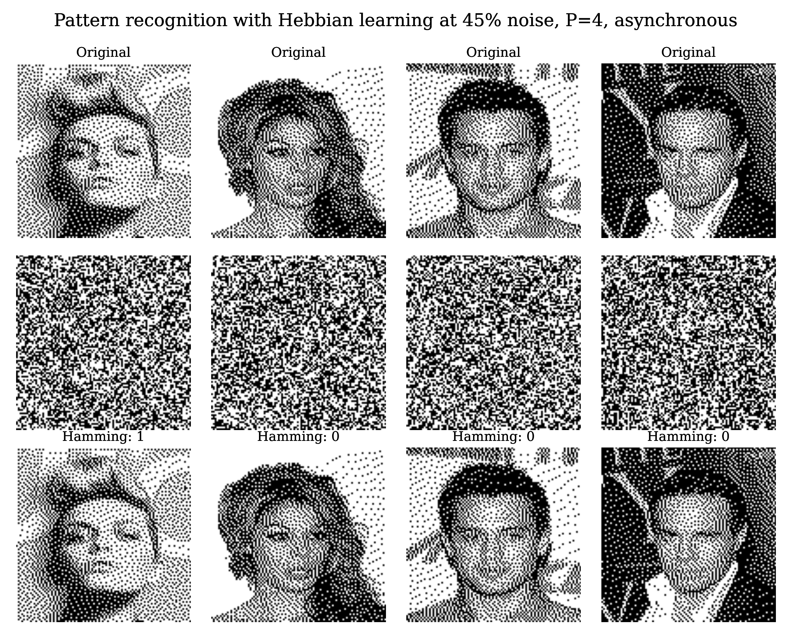
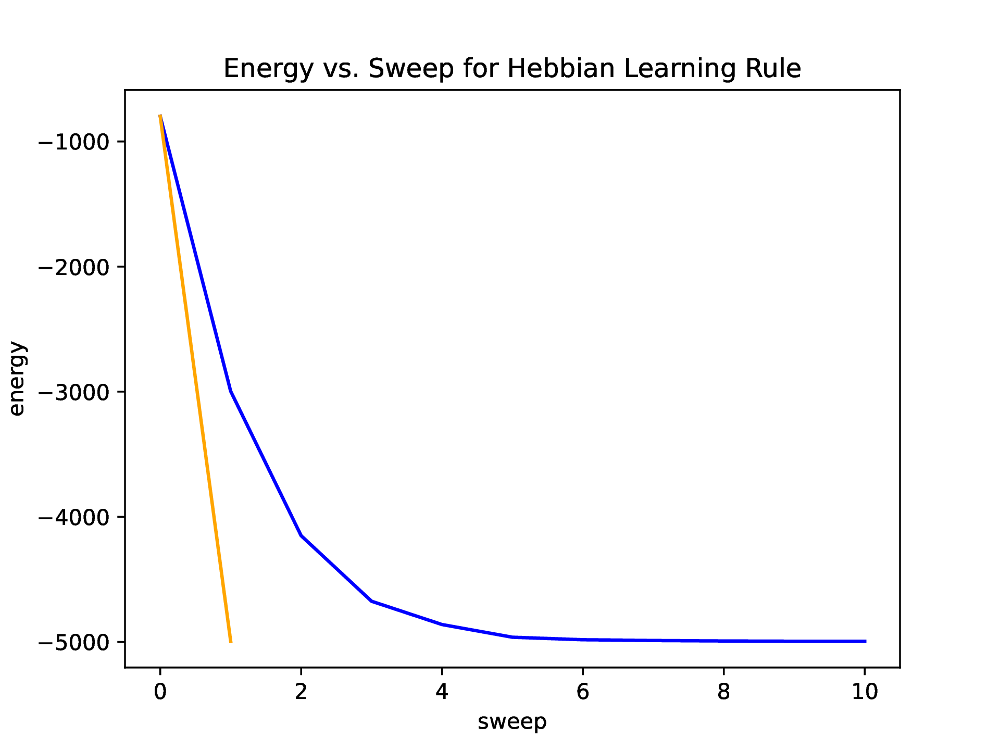
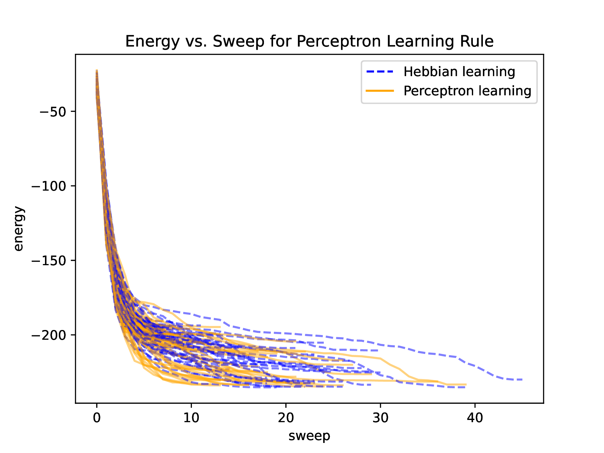
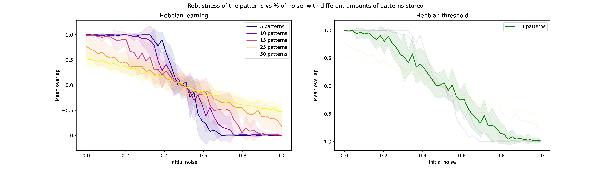
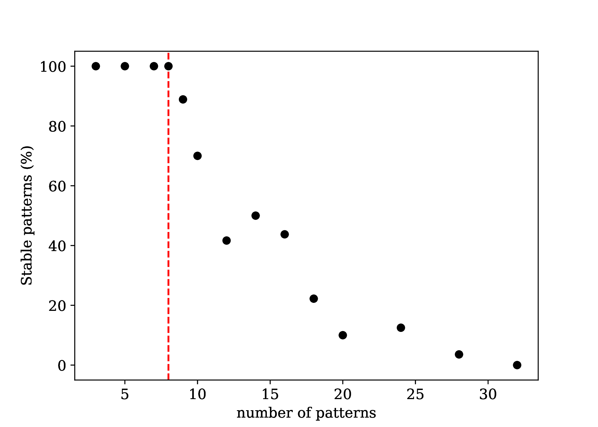
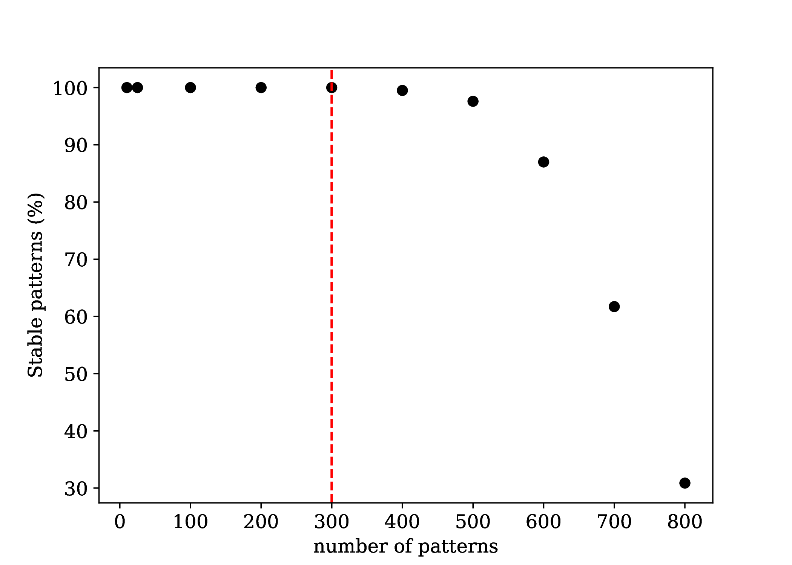

# Hopfield Network

A Python implementation of a Hopfield network that I used to explore associative memory and pattern retrieval.

The project includes Hebbian and perceptron-based learning rules, synchronous and asynchronous updates, and tools to study how well stored patterns can be recovered after being corrupted.

## What I explored

* Storage and retrieval of binary patterns
* Hebbian learning
* Perceptron-based learning
* Synchronous and asynchronous updates
* Pattern corruption and reconstruction
* Overlap between retrieved and stored patterns
* Energy evolution during retrieval

Some of the experiments use randomly generated patterns, while others use binary images from the CelebA dataset.

## Example results

Example of pattern reconstruction using the hebbian learning rule with asynchronous update:



Evolution of the energy until convergence

<table>
  <tr>
    <td align="center">
      <br>
      <b>Evolution of the energy, synch. (yellow), asynch. (blue), hebbian</b>
    </td>
    <td align="center">
      <br>
      <b>Evolution of the energy for perceptron and hebbian learning</b>
    </td>
  </tr>
</table>


Robustness to initial noise with different amounts of patterns:



Stability vs number of patterns saved:

<table>
  <tr>
    <td align="center">
      <br>
      <b>Similar patterns</b>
    </td>
    <td align="center">
      <br>
      <b>Random patterns</b>
    </td>
  </tr>
</table>

## Project structure

* `src/hopfield/` — main implementation
* `figures/` — figures generated from the experiments
* `results/` — saved experimental results
* `report/` — pdf document explaining the results

## Report

A more detailed description of the experiments and results is available in the
[full project report (PDF, French)](report/hopfield_network_report.pdf).

## Installation

Clone the repository and install the package in editable mode:

```bash
git clone https://github.com/LoicGnocchini/hopfield-network.git
cd hopfield-network
pip install -e .
```

The preprocessed image datasets used in the experiments are already included in `src/hopfield/data/`, so no additional dataset download is required.

All scripts should be run from the repository root directory.

To test the installation and run a simple Hopfield network demonstration:

```bash
python -m hopfield.network
```

The project requires Python 3.9 or newer.
